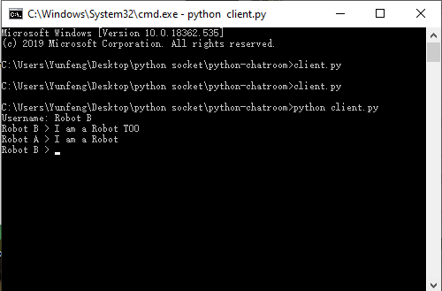

# Python-chatroom
a chatroom client/service interaction practice using socket

The server will record every messages are transfered by bytes.
 

The client will ask user's user name. After that, the user will be able to communicate with other clients who are connected with the server
Client side currently is not real-time delivering. Will update onces the UI is finished.

